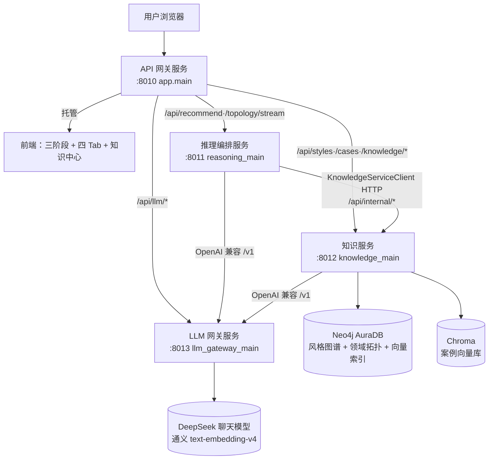
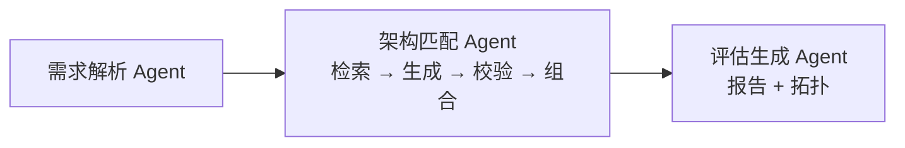
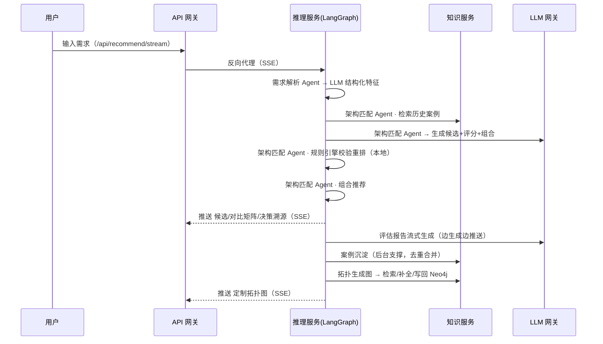

# ArchWise 架构设计文档

> 本文档对照仓库当前真实实现编写。系统已按四个独立 FastAPI 微服务运行，推理流程由 LangGraph 多智能体图编排，知识持久化采用 Neo4j 图谱 + Chroma 向量库。

## 1. 设计目标

ArchWise 是一个"软件体系结构风格智能助手"：接收用户自然语言软件需求，自动完成需求理解、候选架构推荐（≥3 种）、多维度对比、最终评估报告、架构组合推荐、定制拓扑图生成，并具备案例学习（知识进化）能力。

设计上强调三件事：

- **多智能体协作**：用 LangChain/LangGraph 把需求解析、案例检索、架构匹配、规则校验、组合推荐、案例沉淀等环节做成可独立协作的图节点。
- **混合推理**：大模型负责语义理解与生成，规则引擎做硬约束校验，本地匹配器做可解释打分，历史案例做"可选参考"注入——多源协同决策而非单一来源。
- **真实微服务 + 可演进知识层**：四个独立服务、HTTP 通信；知识用 Neo4j（关系型图谱）+ Chroma（向量）持久化，并能从使用中学习。

## 2. 总体架构

系统以**四个独立 FastAPI 进程**运行，服务间通过 HTTP 通信。值得强调的是：**同一套代码库既能跑微服务、也能跑单体**——推理服务在 `app/api/runtime.py` 里根据环境变量 `KNOWLEDGE_SERVICE_URL` 是否存在，决定使用 HTTP 知识客户端（微服务）还是进程内知识服务（单体）。

## 3. 微服务划分设计

### 3.1 四个服务

| 服务 | 端口 | ASGI 入口 | 主要职责 | 拥有数据 |
| --- | ---: | --- | --- | --- |
| API 网关服务 | 8010 | `app.main:app`（= `app.gateway_main`） | 托管前端页面与静态资源；按路径反向代理 `/api/*` 到对应服务（含 SSE 流式转发）；`/health/services` 聚合健康检查 | 无（仅请求态） |
| 推理编排服务 | 8011 | `app.reasoning_main:app` | LangGraph 推荐图编排（需求解析→案例检索→架构匹配→规则校验→组合推荐→案例沉淀）+ 拓扑生成图 + 评估报告流式生成 | 无（无状态计算） |
| 知识服务 | 8012 | `app.knowledge_main:app` | 架构风格库（Neo4j + 种子兜底）、案例记忆（Chroma + 去重合并 + 人工策展）、Neo4j 领域拓扑图谱、知识维护接口 | **唯一持久数据**：Neo4j + Chroma |
| LLM 网关服务 | 8013 | `app.llm_gateway_main:app` | 聊天模型与 embedding 的统一出口，暴露 OpenAI 兼容 `/v1/chat/completions` 与 `/v1/embeddings`，集中密钥、超时与缓存 | 无（可有缓存） |

### 3.2 划分依据

每条边界至少满足以下一项才独立成服务：① 围绕完整业务能力、有清晰接口契约；② 拥有自己的数据（数据自治，最硬边界）；③ 运行特征不同（负载/耗时/伸缩/变更频率）。据此：**知识服务**（唯一拥有持久数据）和 **LLM 网关**（横切基础设施、被多服务共用）是最硬的边界；网关与推理因职责（接入 vs 计算）分离。

### 3.3 服务间契约

- 网关 → 后端：`/api/{path}` 反向代理（`app/services/service_proxy.py`，`/stream` 路径走流式透传）。
- 推理 → 知识：`KnowledgeServiceClient`（`app/services/knowledge_client.py`）调用知识服务的**内部端点**：
  - `POST /api/internal/cases/retrieve`（相似可信案例召回）
  - `POST /api/internal/cases/capture`（运行时案例沉淀）
  - `POST /api/internal/topology/retrieve | normalize | merge`（拓扑知识检索 / 规范化 / 写回）
- 推理、知识 → LLM 网关：通过 `LLM_BASE_URL=http://127.0.0.1:8013/v1` 调用聊天与 embedding。

## 4. 多智能体协作机制（LangGraph）

系统在宏观抽象上是 **3 个核心智能体**协作——**需求解析 Agent / 架构匹配 Agent / 评估生成 Agent**（与界面处理动画、作业举例一致）。其中“架构匹配 Agent”内部又串起检索、生成、校验、组合多个步骤。实现上用 LangChain/LangGraph 编排（`app/services/hybrid_orchestrator.py`），把这些步骤组织成状态图；但对外呈现的智能体抽象就是这 3 个。

### 4.1 三个核心智能体与内部步骤

| 核心智能体 | 职责 | 内部步骤 / 依赖 |
| --- | --- | --- |
| 需求解析 Agent | 自然语言 → 结构化特征（领域/质量属性/数据流/约束/模糊点），Pydantic 校验 | 单步，调 LLM 网关 |
| 架构匹配 Agent | 生成候选架构、评分与组合建议 | 内部多步：检索历史案例(Chroma) → 大模型生成候选与评分 → 规则引擎校验重排 → 组合推荐 |
| 评估生成 Agent | 生成最终评估报告与定制拓扑图 | 流式评估报告 + 拓扑生成（漏项复核→覆盖率→ReAct 补全→合并的循环） |

> 案例沉淀（知识进化）作为**后台支撑机制**随推荐自动进行，不计入对外的智能体抽象；拓扑生成内部是一个 ReAct 式循环（漏项复核 → 覆盖率检查 → 补全 → 合并）。这些都是“架构匹配/评估生成 Agent”的内部步骤，由 LangChain/LangGraph 的图节点承载——对答辩与用户呈现的统一抽象始终是 **3 个核心智能体**。

### 4.2 真实协作时序

## 5. 混合推理机制

系统是**多源协同决策**，不是单一来源拍板：

- **大模型 = 主力**：理解模糊语义、生成候选与报告，对没见过的新需求泛化好。
- **规则引擎 = 事后校验**：用 `data/rules.json` 的硬约束/偏好规则检查 LLM 候选，违规则降权、重排（纯内存、近零耗时，只在明显违规时动手，不损害泛化）。
- **本地匹配器 = 可解释打分**：`ArchitectureMatcherAgent` 基于质量属性给出可追溯的本地评分，作为交叉证据。
- **历史案例 = 可选参考**：检索到相似可信案例时注入匹配环节增强；未命中则不注入，让大模型照常发挥——**知识只做加法、不裁决**，因此单条知识不会劫持结果。

每次推荐产出结构化 `decision_trace`，含：需求特征、规则证据（命中规则/偏好/降权）、案例记忆证据（召回案例+相似度+策略）、本地匹配证据、知识图谱/拓扑证据、评分证据、LLM 复核、组合证据、推荐缓存证据、最终理由——多源证据**可逐项追溯**，对应评分维度的"决策结果可解释性"。

## 6. LLM 集成方案

### 6.1 LLM 网关（OpenAI 兼容）

所有聊天与向量调用统一经 LLM 网关服务的 `/v1` 出口，再由网关代理到真实模型（DeepSeek 聊天 + 通义 text-embedding-v4）。好处：集中密钥、超时、缓存与模型选择；推理/知识服务只认 OpenAI 兼容接口，与具体厂商解耦。

### 6.2 结构化输出与流式

- **结构化输出**：通过 LangChain 的 `with_structured_output`（`OpenAICompatibleStructuredChat` + `response_format=json_object`）把 LLM 结果直接解析为 Pydantic 模型（需求特征、候选架构、案例去重判定等），省去手写 JSON 清洗。
- **流式报告**：评估报告以 SSE 增量推送，与拓扑生成并行，降低等待感。

### 6.3 缓存（提速）

- `recommendation_cache`：对相同/高度相似需求复用推荐结果。
- `llm_cache`：LLM 结果缓存。
- 对应作业"典型挑战应对：提高系统响应速度（LLM 结果缓存机制）"。

## 7. 知识层与存储设计

按"数据形状决定存储"原则，不混用：

| 知识块 | 存储 | 说明 |
| --- | --- | --- |
| 架构风格库（A） | **Neo4j** | 风格—类别—场景—质量属性的关系型图谱；数据小，种子在 `app/knowledge/styles.py`，未连 Neo4j 时由种子在内存构图兜底 |
| 领域拓扑知识（B） | **Neo4j + 原生向量索引** | 场景→能力→组件→存储的图；节点语义向量并入 Neo4j 原生向量索引（消除"图/向量双写"） |
| 案例库（C） | **Chroma 向量库** | 案例需求→推荐风格，按相似度检索；通义 text-embedding-v4（1024 维） |
| 规则（6 条） | 配置（`data/rules.json`） | 是决策逻辑而非知识数据，不进库 |
| 初始种子 | JSON/代码（只读，启动导入） | `styles.py`、`domain_topology.json`、`test_cases.json`，可追溯、可重建 |

### 7.1 架构风格知识图谱（A）

节点：`ArchitectureStyle / Category / Scenario / QualityAttribute`；关系：`BELONGS_TO / SUITABLE_FOR / HAS_SCORE`。当前内置 **12 种风格**（分层、微服务、事件驱动、单体、六边形、整洁、Serverless、管道-过滤器、CQRS、SOA、黑板、MVC），各含 6 维质量评分、优缺点、适用场景与拓扑模板。

### 7.2 领域拓扑知识图谱（B）

节点：`DomainScenario / BusinessCapability / ArchitectureComponent / DataStore`；关系：`REQUIRES / IMPLEMENTED_BY / USES_STORE / STORES_IN / DEPENDS_ON`。用于"按需求能力检索组件/存储/依赖"以生成定制拓扑图。

## 8. 知识进化（案例学习闭环）

### 8.1 案例库自我进化（C）

- **运行时自动捕获（create-or-refine）**：每次推荐后台沉淀；案例沉淀 Agent 让 LLM 扫描全库**精简索引**（标题+一句话+推荐风格），判定 `合并进候选 / 跳过(可信已覆盖) / 新建`，冲突时新建并标注"与可信案例分歧"——**只写候选区、绝不自动改可信集合**（思路借鉴 Hermes 的 create-or-refine，规模小无需向量阈值）。
- **人工策展**：知识中心可手动**新增**（默认候选、可选直接可信；提交前 LLM 做重复/矛盾提示）、**删除**、**提升候选为可信**。
- **检索注入**：只有**可信案例**参与召回注入；注入为"可选参考"，配合规则校验，单条坏案例无法劫持推荐。

### 8.2 领域拓扑进化（B）

拓扑修复图在覆盖率不足时让 LLM 提补丁，经 embedding 语义规范化（近义节点合并）后写回 Neo4j，并把节点向量并入原生向量索引——"同一领域用得越多，图谱越全"。

## 9. 架构组合推荐

当单一风格无法覆盖复杂需求时，组合推荐器（结合 LLM 建议）判断 `composition_needed`，给出主架构 + 支撑架构及其职责与适用位置，并在拓扑图中体现"架构模式职责"分层；对规模偏小、低并发的 CRUD 系统给出"过度设计"提醒。

## 10. 定制拓扑生成

拓扑图按本次需求动态生成（非静态模板），输入含：需求特征、最终推荐、Neo4j 检索到的领域能力/组件/依赖、LLM 补全的业务能力、规则补齐的基础设施（负载均衡、缓存、事件总线、监控等单例去重）、组合职责。前端用 Mermaid 渲染并支持拖拽平移、滚轮缩放、大图查看与导出。

## 11. 可视化设计（前端）

前端为**三阶段渐进体验 + 四 Tab 结果页 + 知识中心**：

- **阶段一·输入**：干净输入框、示例需求、场景快捷标签。
- **阶段二·处理**：三个 Agent 依次打勾的协作动画（展示多智能体协作）。
- **阶段三·结果（四 Tab）**：推荐总览（主推荐大卡 + 备选 + 组合策略）、对比分析（六维雷达 + 评分柱状 + 逐项手风琴 + 全量对比矩阵折叠）、架构拓扑（Mermaid 大图 + 缩放/平移）、决策溯源（需求特征 → 规则+案例记忆 → 匹配信号，三步人话 + 技术细节折叠）。
- **知识中心**：概览仪表盘（风格/案例计数、来源构成、Neo4j 状态）、风格知识图谱与领域拓扑图谱（vis-network 力导向图）、案例数据库（筛选 + 新增/删除/提升可信）。

## 12. 与作业要求的对应关系

| 作业要求 | 系统实现 |
| --- | --- |
| 需求分析（语义理解+特征提取） | 需求解析 Agent + LLM 结构化抽取 + Pydantic 校验 + `ambiguity_notes`（AI 不确定性） |
| 架构推荐 ≥3 候选 | 架构匹配 Agent 强制返回 ≥3，含主流风格 |
| 决策支持（多维对比 + 优缺点报告） | 对比矩阵 + 六维雷达/柱状 + LLM 评估报告 + 决策溯源 |
| 知识进化（**进阶**） | 案例学习闭环（运行时去重合并 + 人工策展 + 检索注入）+ Neo4j 拓扑进化 |
| 微服务（建议） | **四个真实独立服务**，HTTP 通信，同套代码可单体/微服务切换 |
| ≥3 类智能体 | 需求解析 / 架构匹配 / 评估生成 三个核心智能体（内部由多步协作编排） |
| 集成 LLM | DeepSeek 聊天 + 通义 embedding，统一经 LLM 网关 OpenAI 兼容出口 |
| 需求理解模块 | 并发/数据流/部署约束等结构化特征 |
| 知识库模块（≥10 风格知识图谱） | Neo4j 风格图谱，12 种风格 |
| 推理决策模块（规则引擎+LLM 混合） | LLM 主力 + 规则引擎事后校验 + 本地匹配器 + 案例注入 |
| 可视化模块（对比矩阵 + 拓扑渲染） | 对比矩阵 + Mermaid 拓扑（可缩放平移）+ 知识图谱 vis-network |
| Web API | 网关 + 各服务 `/docs` |
| 技术建议：LangChain / Neo4j / 缓存 / 规则校验 | 全部采用 |
| 创新：决策溯源 / 组合推荐 | 均实现（架构重构建议模块列为未来方向） |

## 13. 小结

ArchWise 的设计核心不是让 LLM 单独决策，而是把**大模型的语义能力、规则引擎的可靠性约束、本地匹配器的可解释打分、历史案例的经验参考**在一张 LangGraph 多智能体图里协同起来，并以四个真实微服务承载、用 Neo4j + Chroma 持久化可演进的知识。既能处理需求的模糊性，又保证推荐过程可解释、可追溯、可进化。
